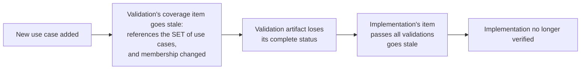

# Glossary — the working vocabulary

> **What this is:** the controlled vocabulary for the methodology being rebuilt
> in this repo — draft 1, decanted from the design conversation of 2026-07-03,
> written for joint markup. When a term is contested, this file is where it
> gets settled. What it is not: a method definition — workflows, templates,
> and tooling come after this vocabulary and the requirements stabilize.

Status: draft, under joint markup · Updated: 2026-07-03

## Core terms

| Term | Working definition |
|---|---|
| **Artifact** | A durable, versioned document (or code tree) recording one aspect of a project. The load-bearing element of the methodology: everything else exists to create, change, or assess artifacts. |
| **Checklist** | A short list of yes/no items attached to an artifact (or workflow) defining what "good enough for a purpose" means. An artifact may carry several checklists, each named for the purpose it certifies (`ready-to-implement-against`, `production-complete`) — a readiness level is just a named checklist, so there is no separate "maturity" concept. |
| **Checklist status (of X)** | The derived state of X's checklists: which items are satisfied, as of X's current content. Never asserted, always recomputable from recorded item answers. |
| **Checklist item** | One yes/no question inside a checklist, answerable with evidence. Each item records its **evaluation method**: `deterministic` (a command whose result answers it) or `judged` (a named role answers it; answer and time recorded). |
| **Judged item** | An item requiring judgment — and, by convention, a bookmark marking intent not yet externalized into artifacts. A judged item that repeatedly causes rework has earned externalization into concrete statements (often becoming deterministic). Driving the judged count to zero is not a goal: cheap, stable judgments may stay judged, and one root item — "this is still what I want" — is permanently judged by the source-of-intent role, because it is checked against the person, not against any artifact. |
| **Relationship** | A maintained, explicit reference from a checklist item to something else: another artifact's content, one of its named checklist statuses, or a set of artifacts ("every use case…"). Relationships are what make change propagation and status honest. The item-dependency graph they form must be acyclic; when a genuine mutual dependency appears, break one direction with a judged item or split an artifact. |
| **Stale** | The state of a checklist item whose recorded answer can no longer be trusted: its artifact changed, or something it references changed (content, status, or set membership). Stale means needs-re-evaluation, not failed. |
| **Change propagation** | The consequence of any edit: when an artifact's content changes, every item that references it goes stale; stale items are re-evaluated; wherever a checklist status flips, the process repeats from there. Status changes are the propagation signal, so an edit that flips nothing stops the cascade immediately. |
| **Verified** | Always relational: "based on what is defined in the upstream artifacts, this artifact has been verified" — against their current state, as of evaluation time. Never an absolute or permanent stamp; change propagation is what keeps the claim honest over time. |
| **Gate** | A point (usually in a workflow) requiring named checklists to be satisfied before proceeding. Gates reference checklists by name; they never define their own items. Informal first: a gate earns a name when the workflow it belongs to gets codified. |
| **Workflow** | A written, repeatable way of creating or changing artifacts: steps, inputs, outputs, what-comes-next guidance. Glue, not law: any manipulation that leaves checklists satisfied is legitimate; manipulations that recur get codified into workflows; an experiment that degrades checklist status has proven itself non-durable. |
| **Role** | A named bundle of skills and goals a project needs — defined by what it brings to the table, never by who fills it. Assignment (which human, which AI) is per-project and deliberately experimental. Two capability constraints hold regardless of assignment: an item's checker must be independent of the author of the thing checked, and the source-of-intent role can only be filled by the entity whose intent it is. A role definition is itself an artifact. |
| **Project** | One endeavor with its own artifacts. Current scope: one person, weekend-size and up, greenfield first. |

## Change propagation, walked through

Adding a use case — nothing else touched — honestly drains "verified" from the
implementation until it is re-earned:

Note the set-reference: items that quantify ("every use case has a validation")
depend on set membership, not on any one artifact, and the maintained
relationships record that.

## Where change enters (root-cause routing)

All change enters through the artifact that **owns the decision**, then
propagates. "I don't like how the application flows" becomes an edit to the
artifact owning flow requirements; the ripple then shows the exact downstream
impact. The owning artifact is the root *cause*, not necessarily the root of
the graph — a color preference lands in a style constraint or a decision
entry, not beside the project objective. The ratchet turns both ways:
sometimes the honest fix is relaxing or deleting an upstream statement, and
propagation makes that a visible, reviewable event instead of silent drift.

There is deliberately no "feedback" concept. The alternative homes for a
reaction — the chat, someone's head, a patch to the downstream artifact — all
destroy or hide intent. Routing is the agent's job, not the human's: "make it
green" stays three words; the method updates the owning artifact, the
implementation, and the statuses in one unit of work.

## Artifact categories

Every project has at least one artifact in each category; how much each
demands is tuned by its checklists, so a use-case-exploring prototype stays
light.

| Category | Holds |
|---|---|
| **Intent** | Objective, users, scope, success criteria; decisions with alternatives considered and rejected |
| **Behavior** | What the system does, for whom |
| **Implementation** | How it is constructed: architecture, technology choices, the code. (The artifact is *implementation*; the workflow is *implement* — "build" is banned as noun/verb-ambiguous) |
| **Deployment** | How it runs: environments, topology, operations |
| **Validation** | How it is proven: checks tied to behavior and success criteria; the evidence |

## Requirements process terms

| Term | Working definition |
|---|---|
| **Candidate requirement** | An idea for what the methodology must support, tracked in CANDIDATES.md with its source, written to stand alone. Costs nothing while parked; never deleted for being unfashionable. |
| **Active requirement** | A candidate jointly promoted for the current iteration — the set actually being designed against. |

## Deliberately not in the vocabulary

~~rule~~ (→ checklist) · ~~metric~~ (→ checklist status) · ~~maturity~~ (→
named checklists) · ~~phase~~ · ~~build~~ (→ implementation / implement) ·
~~feedback~~ (→ a change to the owning artifact) · ~~acceptance~~ (→
checklists, plus the one permanent root judged item) · ~~done~~ as a
free-floating claim (only checklist statuses and gates)

## Open points (not yet settled)

- **Checklist proliferation guard** (proposal, not decided): at most two named
  checklists per artifact type until real friction demands more; a checklist's
  name must say who is waiting on it.
- **Storage and format** of artifacts, checklists, recorded answers, and
  relationships: parked as a data-modeling/technical-architecture question.
  One requirement already flows into it: the format must support fast,
  deterministic, read-only evaluation (CANDIDATES.md, R13/R25).
- **Multi-person projects**: out of scope now by decision, not by accident.
