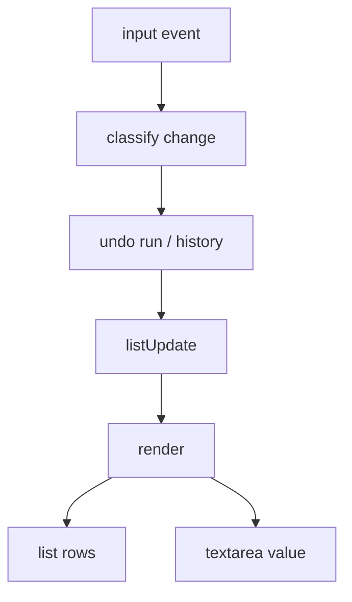
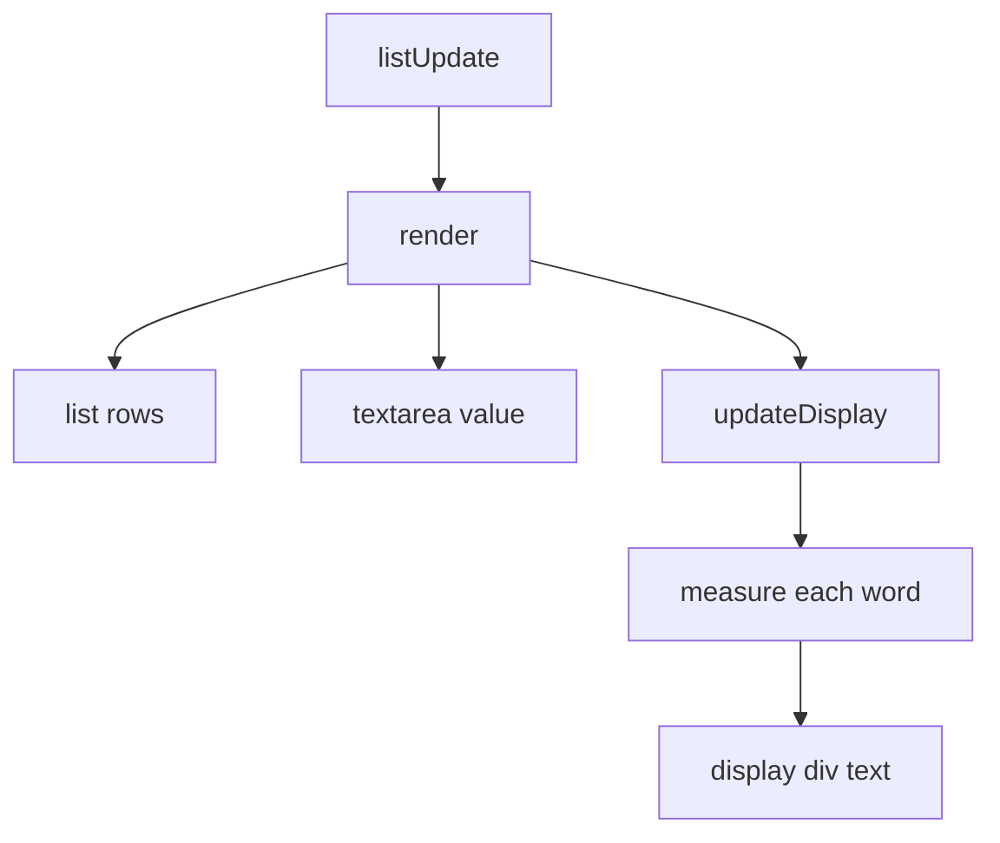
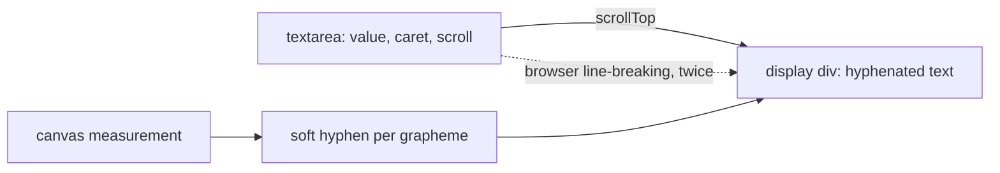

# Implementations 3 and 4 — how the code compares

**What this is:** a read of the two implementations as engineering — structure,
robustness, testability — and what a written architecture guide would have
settled in advance. **What it is not:** an acceptance-criteria audit; both runs
report PASS. **How to read it:** the load-bearing finding first, then the one new
mechanism, then the guide decisions it argues for.

## The load-bearing finding

Implementation 4 is implementation 3 with three small edits and one new
subsystem. Against 3's 841-line file the diff is 164 lines added, 50 removed —
and the entire editing, undo, `listUpdate`, selection and event layer is
byte-identical. There is therefore almost no "4's structure versus 3's
structure" to compare. There is 3's structure, plus a two-layer right pane that
3's structure had nowhere to put.

All of implementation 4's new risk is in that one place, and it is exactly the
place where no guide existed. The decision-guides note now says so, in the
foreseen-areas list that 4's review added: "implementation 4 was the first to
need a rendering layer distinct from the interactive control, and decided its
shape, its alignment with the control, and where a split may fall inside a word
with no question to answer."

Two concrete consequences, both reproduced here in Chromium:

- The two layers can differ in height, and then the end of an idea becomes
  unreadable. With an idea whose first word is 3,000 characters followed by
  ordinary lines, the display layer is 48 px (two lines) taller than the
  textarea; scrolling the textarea to its bottom leaves the last line 33 px
  below the pane's bottom edge. The shipped test data does not reach this — its
  216-character run measures 8829 px in both layers.
- "One character" has three different definitions in implementation 4's one
  file. Review fixed one of them; the same class of bug survives untouched in
  the undo layer of both implementations.

## What actually changed

| Use-case change | Where it landed | Size |
| --- | --- | --- |
| Message list opens empty | one branch deleted from `renderMessages` (3:415–435 → 4:517–536), one CSS rule, one test-hook class | a few lines |
| Ordering compares entire content | one comparator expression (3:331–338 → 4:360–368) | one line |
| Title truncates after a partial word | nothing — `text-overflow: ellipsis` already truncated by width (3:118–129 is identical to 4:119–130); only test data and a check row were added | no code |
| List button always present, × only with a message | nothing — already true in 3; a check row was added | no code |
| A word wider than the right pane is split with display-only hyphens | a new two-layer pane: 4 lines of HTML, ~40 of CSS, ~55 of JS (4:390–445, 4:485–488) | the only new subsystem |

| Unchanged, byte for byte, from 3 to 4 |
| --- |
| `beforeinput`/`input` capture and change classification (3:595–631 = 4:692–728) |
| the undo history, runs, and deletion-run bookkeeping (3:633–693 = 4:730–790) |
| `listUpdate` — stripping, blank deletion, re-sort, message (3:530 = 4:627) |
| selection, New, leaving, keyboard shortcuts, visual-viewport handling |
| the message model (`messages` array plus `currentMessage`) |

Implementation 4 did not rewrite anything. It edited three expressions and
appended one layer.

## Data flow, before and after

*Implementation 3: one render function writes both views.*

*Implementation 4: `render` gains a third output, which measures before it writes.*

## The two-layer right pane

The design is sound and economical: a soft hyphen is inserted between every
grapheme of any word measured wider than the pane, and the browser renders only
the one that it actually needs to break at. The alternative the note records —
computing break points and forcing them with ` ` — was rejected for a stated
reason, that the invisible interactive layer would still find its own break
points independently. That reasoning is right.

What is missing is not a different mechanism but a named layer with rules. Three
things follow from its absence:

- **No invalidation rule.** `updateDisplay` runs unconditionally at the end of
  every `render` (4:485–488), and re-measures every word in the idea on every
  keystroke: two `getComputedStyle` calls plus one canvas `measureText` per word
  (4:392–422), and a fresh `Intl.Segmenter` per overlong word (4:407–413). I
  measured about 9 ms per input cycle for the 19,000-character test idea in
  headless Chromium on this machine. Fine there; unmeasured on the iPad.
- **No alignment contract.** The two layers agree because both use the browser's
  line-breaking on nearly the same text. The structure note anticipates the
  horizontal half of the disagreement — "the blinking caret can sit very
  slightly ahead of or behind the character it appears to be next to" — but not
  the vertical half, which is the one that hides text (see the finding above).
- **No owner for measurement.** Measurement lives inline in the view, reading
  computed style on every render, with the canvas font string assembled from
  weight, size and family only (4:392–395); the note's own "a word the canvas
  under-measures would be clipped" gap is a symptom of measurement having no
  home.

Things I checked and found sound: the native selection band paints over the
display layer with the text still legible; layer heights agree exactly for
ordinary text and for the shipped large idea; the overlay is genuinely inert
(`pointer-events: none`, `user-select: none`); no soft hyphen ever reaches the
model or the textarea's value.

## Robustness

- **"One character" has three definitions.** UTF-16 code unit in the deletion
  classifier (4:754–785, identical to 3:657–684); grapheme cluster in the
  display splitter (4:403–413, added by review); one Backspace press per
  grapheme in the checks (4/verify.js:421). I ran both implementations:
  backspacing through the word `ab😀cd` takes **two** undo entries — the first
  Ctrl+Z restores `ab` — while `abXcd` takes one. The emoji breaks the deletion
  run, contrary to the use case's grouping by unit. The review fixed the display
  instance of precisely this bug and could not see the undo instance, because
  nothing names the concept in one place.
- **Two definitions of "word".** `unitsOf` for undo (4:670) and `/\S+/` in
  `hyphenate` (4:417) happen to agree; nothing makes them agree.
- **DOM identity** is rebuilt on every keystroke and carried only in `data-id`
  (4:447–468). That is what let 4's checks re-find an edited idea once ordering
  by whole content could move it.
- **Event handling** is 3's and is careful: a `pending` object captured in
  `beforeinput`, caret-move detection on `keyup`/`pointerup`/`select` rather than
  `selectionchange`, the control's own history cancelled. Unchanged in 4.

## Testability

| | 3 | 4 |
| --- | --- | --- |
| Named checks in the script | 68 | 82 |
| Hooks | ids and classes | plus `data-id`, `#text-wrap`, `#text-display` |
| Locating an idea | exact visible title | title for a first lookup; `data-id` once an idea has been edited (4/verify.js:367) |
| Mutation testing | three deliberate faults | three, each aimed at a 4-specific change |

Where a check is weaker than its row claims: `wordSpanningSeveralLinesHyphens‑
EverySplit` (≥2 soft hyphens, 4/verify.js:178) and `longUnbrokenRunHyphens‑
EveryLineItSpans` (≥3, 4/verify.js:191) are close to vacuous, because
`hyphenate` puts a soft hyphen between *every* grapheme of a marked word — a
60-letter word yields 59. Those two rows and `rightPaneSplitsWideWordWithHyphen`
all rest on one observation: some word was marked. The note is honest about it
("a lower bound only ... 'every line' is left to the screenshot review"), and
review demoted the row to inspection. Separately, every expected row count is a
literal, and all of them shifted by 9 when the test data grew by three items.

## What a better-defined architecture would have prevented or made cheaper

| Decision a guide could fix in advance | What in 3 or 4 shows the need |
| --- | --- |
| **Model/view separation with one render function**, and the rule that every view output is written there | Already true in both; 4's new layer was appended to `render` by hand and could as easily have been called from the input handler |
| **An explicit text-layout layer**: what owns line breaking, what the alignment contract between the seen text and the caret is, when it is invalidated | The layer-height divergence nobody owns; `updateDisplay` re-measuring everything per keystroke |
| **Where measurement lives**, and that measurements are cached by (word, width, font) | `getComputedStyle` plus canvas measurement inside the view, per render, per word |
| **One definition of character and word**, used by editing, layout and checks alike | The emoji deletion run splitting in both implementations; two independent notions of "word" |
| **How identity is assigned and used, including by tests** | `data-id` re-lookup, discovered only while writing 4's checks |
| **The test-hook contract**: hooks are interface, a check states what it observes, counts derive from the test-data set | Soft-hyphen lower bounds standing in for "a hyphen at every line"; literal row counts shifting by 9 |

**Opinion:** the first three would have changed implementation 4's code; the
fourth would have caught a real defect that both implementations still carry;
the last two would have made the checks cheaper to keep rather than better.

## Decision points

**1. When to write the implementation-structure guide.** Now, from four
instances, or after implementation 5. Trade-off: writing it now risks
generalising from one hard case (the right pane); waiting leaves the next
implementation to re-decide layering alone, as 4 did. Rewind: a guide is a note
like any other; a wrong question is cut.

**2. What to do about the right pane's layer contract.** Keep the soft-hyphen
overlay and add an alignment rule plus a check comparing the two layers'
`scrollHeight`; or move layout ownership into the display layer and drive the
caret from it (a much larger change, touching every render); or relax the use
case's sentence. Rewind: the overlay is about 100 lines in one place — deleting
it restores implementation 3's single textarea exactly.

**3. Whether to fix "one character" now.** A small refactor: one shared notion
of grapheme and unit, used by the classifier and the splitter, plus one check
that deletes through an emoji. Or record it as a known gap alongside the
existing two. Rewind: trivial either way.

## What I verified, and what I did not

Verified in headless Chromium here: the emoji undo-run split (in both
implementations), the layer-height divergence and the unreachable last line, the
per-keystroke render cost, selection painting over the display layer, layer
agreement for the shipped test data. Not verified: WebKit, a real iPad, the
on-screen keyboard, autocorrect, the clipboard. Opinion, not measurement: that
the soft-hyphen overlay is the right mechanism for this spec, and that its
missing piece is a named layer rather than a different trick.
